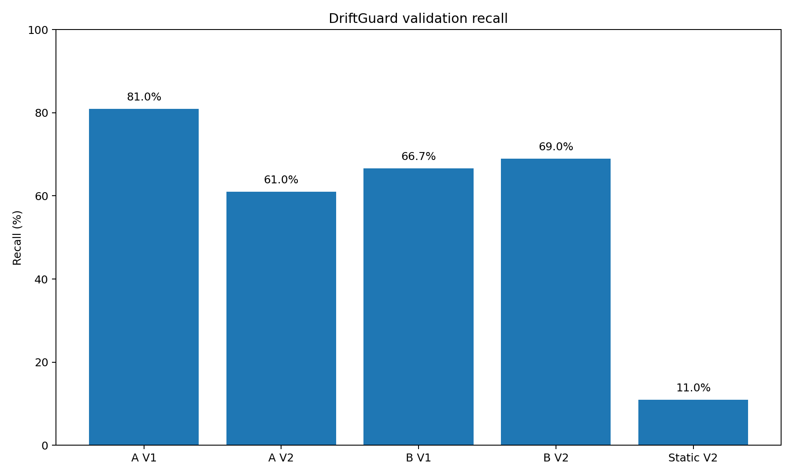
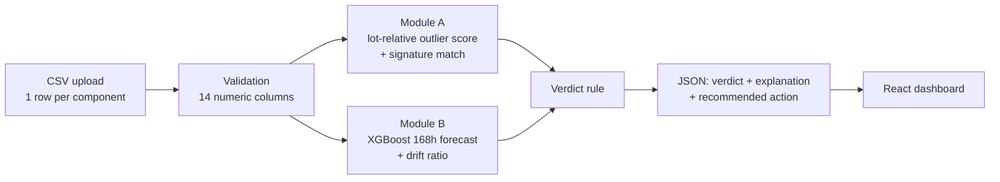

<div align="center">

# 🛰️ DriftGuard

### Explainable AI screening for latent defects in component burn-in

**SIH 2026 · Problem Statement 26170 (ISRO) · AI-Driven Anomaly Detection in Component Burn-In & Screening**

[](https://driftguard-ivory.vercel.app/)


</div>

<!-- TODO (team): add the YouTube demo link and slide deck link here before submission. -->

> **We don't just flag anomalies. We say *which failure mechanism* is likely at work, and we recommend an *action* (reject, review, or pass), the way a QA engineer would.**

---

## 🔗 Quick links

| | |
|---|---|
| 🌐 **Live app** | https://driftguard-ivory.vercel.app/ |
| 📊 **All validation numbers** | [`results/`](results/) (generated by [`validation/run_stress_test.py`](validation/run_stress_test.py)) |
| 🧪 **Sample input CSVs** | [`data/`](data/) |
| ⚙️ **Backend API docs (local)** | `http://127.0.0.1:8000/docs` after starting the backend |

> ⏱️ **Judges, please note:** the backend runs on a free hosting tier that sleeps when idle. If the first upload takes ~30–60 seconds, it is waking up, not broken. Retry once.

---

## ⚡ 60-second judge summary

| Question | Answer |
|---|---|
| **What does it do?** | Upload a CSV of burn-in readings, get a per-component verdict (`REJECT` / `FLAG_FOR_REVIEW` / `PASS`) with a written explanation. |
| **Is it working end to end?** | Yes. The live app runs the same pipeline as this repo: CSV → FastAPI → Module A + Module B → verdict → dashboard. |
| **Is the data real?** | **No. All data is synthetic** and generated by us. No real ISRO data was available. The full spec and generator settings are in [Data & reproducibility](#7-data--reproducibility). |
| **How do we know it generalises?** | A second, blind dataset (**V2**) with doubled noise, shifted baselines and a different defect mix was **never used** to tune any threshold. |
| **What's the headline result?** | On blind V2, Module A catches **61%** of defects at **93.9% precision**. A static datasheet-limit check catches **11%**. That is about **5.5× more** defects. |
| **What are the weak spots?** | Module B has low precision under domain shift (15.7%) and is nearly blind to propagation delay. We report this openly in [Limitations](#8-️-honest-limitations). |

---

## 1. The problem

High-reliability electronics (space, defence, medical) go through **burn-in**: they run at elevated temperature (e.g. 125 °C) for 168 h while parameters are measured at 0 h, 24 h, 96 h and 168 h.

Classic screening uses **static pass/fail limits**. But a *latent defect* can stay inside the datasheet limit and still drift abnormally. Example: a lot averages 10 µA leakage and one part reads 45 µA. That is a massive anomaly, yet it is still under a 50 µA limit and passes a static check.

The problem statement asks for:

* **Module A**: a *dynamic* outlier detector (relative to the lot, not to a fixed limit).
* **Module B**: a regressor that forecasts the 168 h value from the 0 h and 24 h readings, and flags parts whose predicted drift exceeds a safety slope.
* Evaluation on **missed defects (false negatives)**, **drift prediction MAE**, and **explainability to a QA inspector**.

## 2. Our approach

Most solutions will be "z-score + regressor + dashboard". We built that core and added three things aimed at how a real QA engineer works:

| Pillar | What it means here |
|---|---|
| **1. Failure-signature diagnosis** | A flagged part is matched against three physics-informed defect signatures (Gate Oxide, Bond Wire, Generic Latent). The output says *why* it looks bad. |
| **2. Cost-aware triage** | The final output is an action, not a bare score. A `REJECT` is reserved for cases with strong evidence. Weaker evidence goes to manual review. |
| **3. Domain-shift stress test** | Every synthetic-data ML project is self-graded. We built a second dataset (noise 2% → 4%, shifted baselines, different defect mix, more lot-to-lot variance) and froze all thresholds *before* scoring it. |

## 3. Results

All numbers below come from [`results/stress_test_metrics.json`](results/stress_test_metrics.json). To regenerate them, run `python validation/run_stress_test.py` (see [Reproduce the results](#reproduce-the-results)).

### Detection: blind V2 dataset (1,000 components, 100 defective)

| Method | Recall | Precision | Specificity | TP / FP / FN |
|---|---|---|---|---|
| **Module A** (dynamic, lot-relative) | **61.0%** | **93.9%** | 99.6% | 61 / 4 / 39 |
| **Module B** (XGBoost drift forecast) | **69.0%** | 15.7% | 58.9% | 69 / 370 / 31 |
| Static datasheet-limit baseline | 11.0% | 100% | 100% | 11 / 0 / 89 |
| **Combined verdict, `REJECT` only** | 51.0% | **96.2%** | n/a | 51 / 2 (53 rejected) |

The static baseline flags a part if **any** reading at **any** time point (including 168 h) exceeds the datasheet limit. That is generous to the baseline, and it still finds only 11 of 100 defects.

**Combined verdict counts on V2:** 53 `REJECT` · 401 `FLAG_FOR_REVIEW` · 546 `PASS`.

**Hidden defects** (defective parts whose 168 h readings all stay inside datasheet limits) number 69 of the 100 V2 defects. Module A detects 38 of them (55.1%) and Module B detects 45 (65.2%).



### Domain shift: V1 held-out vs V2 blind

| Module | V1 held-out recall | V2 blind recall | V1 precision | V2 precision |
|---|---|---|---|---|
| Module A | 81.0% (17/21) | 61.0% | 70.8% | 93.9% |
| Module B | 66.7% (14/21) | 69.0% | 87.5% | 15.7% |

Module A's recall falls about 20 points under domain shift, but its precision stays high. Module B keeps its recall but loses most of its precision, so it cannot be trusted to reject parts on its own. That is why the verdict rule below never lets Module B reject alone.

### Drift prediction accuracy (MAE of predicted 168 h value)

Full table: [`results/module_b_mae_comparison.csv`](results/module_b_mae_comparison.csv). The baseline is a two-point linear extrapolation, `V24 + 7·(V24 − V0)`.

| Dataset | Parameter | XGBoost MAE | Linear baseline MAE |
|---|---|---|---|
| V1 held-out | iddq | **0.72** | 2.77 |
| V1 held-out | leakage | **1.29** | 3.47 |
| V1 held-out | prop_delay | **0.17** | 0.96 |
| V2 blind | iddq | **1.79** | 4.82 |
| V2 blind | leakage | 6.57 | **4.90** |
| V2 blind | prop_delay | **0.47** | 2.12 |

XGBoost beats the baseline on 5 of 6 rows. On V2 **leakage** it is *worse* than the baseline, which we report rather than hide (see [Limitations](#8-️-honest-limitations)).

---

## 4. How it works



### Module A: dynamic outlier detection (`backend/module_a.py`)

Module A is pure robust statistics with no trained model, so every decision can be explained.

1. Use only the **0 h, 24 h and 96 h** readings. The 168 h reading is never scored.
2. For each `(lot, time point, parameter)`, compute the **median and MAD** at runtime from the uploaded data. There are no lookup tables, so unseen lot IDs work.
3. Score each reading: `score = max(0, |value − median| − 0.02·value) / MAD`. The `0.02·value` term is a **2% measurement-tolerance margin** so sensor noise is not flagged.
4. The component score is the **maximum** over all parameters and time points. It is **flagged if score > 4.5**. The threshold was chosen on a V1 held-out split, and V2 was never touched.
5. For flagged parts, the drift pattern is matched (by distance to normalised prototype vectors) to one of:

| Signature | Pattern |
|---|---|
| **Gate Oxide Degradation** | high iddq and leakage drift, minimal delay drift |
| **Bond Wire Fatigue** | minimal iddq and leakage drift, high delay drift |
| **Generic Latent Defect** | moderate drift across all three |

The signature confidence shown in the UI is the per-type identification accuracy measured on blind V2: Gate Oxide 0.75, Bond Wire 1.00, Generic Latent 0.88.

### Module B: hidden-defect predictor (`backend/module_b.py`)

* **Input:** only the 0 h and 24 h readings, 15 features in total (6 raw values plus per-parameter delta, rate and ratio).
* **Model:** three independent XGBoost regressors (iddq, leakage, prop_delay) frozen in [`backend/models/driftguard_module_b_v3_FINAL.pkl`](backend/models/). The loader **refuses to start** if the artifact's features, threshold or safety slopes differ from the contract.
* **Decision:** `drift_ratio = max(|pred₁₆₈ − v₀|, |pred₁₆₈ − v₂₄|) / (safety_slope × 168 h)`. A part is **flagged if the maximum ratio across parameters is > 1.25**.
* Safety slopes (frozen constants): iddq 0.02782, leakage 0.02404, prop_delay 0.01083.

### Verdict rule (`backend/verdict.py`)

| Module A | Module B | Matched signature | Verdict | Recommended action |
|:-:|:-:|---|---|---|
| ✅ flagged | ✅ flagged | any | **REJECT** | Immediate rejection |
| ✅ flagged | clear | Gate Oxide (high cost weight) | **REJECT** | Immediate rejection |
| ✅ flagged | clear | Bond Wire / Generic Latent | **FLAG_FOR_REVIEW** | Manual review |
| clear | ✅ flagged | n/a | **FLAG_FOR_REVIEW** | Manual review |
| clear | clear | n/a | **PASS** | Proceed |

**Why Module B alone can never reject:** its precision on blind V2 is 15.7%, so it works as an early-warning signal that sends parts to a human. Module A alone can reject only when the matched failure mechanism carries a high cost weight.

> ℹ️ The cost weights (high / medium / low) are **illustrative project assumptions, not sourced industry figures**. The API reports `policy_status: "PROPOSED_TEAM_RULE_V3"` so this is visible to anyone using it.

Every result includes a plain-language `explanation` string. Example:

> *"Both independent screening modules flag the component. Signature validation confidence shown for the matched prototype: 0.75. Recommended action: Immediate rejection."*

---

## 5. Using the app

Open the [live app](https://driftguard-ivory.vercel.app/) and upload a CSV from [`data/`](data/). The sidebar has these pages:

| Page | What you see |
|---|---|
| **Data Upload** | Upload a CSV, validate it, and run the analysis. |
| **Dashboard** | Summary counts of `REJECT` / `FLAG_FOR_REVIEW` / `PASS` and flags per module. |
| **Components** | A searchable, paginated list of every component and its verdict. |
| **Component Details** | For one part: raw readings, Module A score and signature, Module B prediction, verdict, and explanation. |
| **Lot Analysis** | Per-lot comparison. |
| **Prediction** | Module B's forecast 168 h values and drift ratios. |
| **Validation** | If the CSV includes label columns, a confusion-matrix view (TP / FP / FN / TN). Labels are used only for display and are never passed to a module. |

<!-- Add screenshots here:  -->

### Input CSV format

One row per component, **wide format**, no missing values, all numeric measurements:

```
component_id, lot_id,
iddq_0h, iddq_24h, iddq_96h, iddq_168h,
leakage_0h, leakage_24h, leakage_96h, leakage_168h,
prop_delay_0h, prop_delay_24h, prop_delay_96h, prop_delay_168h
```

Optional metadata columns (`is_defective`, `archetype`, `curve_shape`, `hidden_within_limits`) are preserved for the Validation page but are **never** used by the modules. Invalid uploads are rejected with a clear error message (missing columns, duplicate `component_id`, non-numeric or missing values).

### API

| Method | Endpoint | Purpose |
|---|---|---|
| `POST` | `/analyze` | Upload a CSV (`multipart/form-data`, field `file`) and get the full analysis. |
| `GET` | `/health` | Health check. |
| `GET` | `/model-info` | Thresholds, model names, and verdict policy status. |
| `GET` | `/docs` | Interactive Swagger UI. |

```bash
curl -X POST http://127.0.0.1:8000/analyze -F "file=@data/synthetic_components_v2_stresstest.csv"
```

The response has `metadata`, `components[]` (each with `raw_values`, `module_a`, `module_b`, `verdict`, `explanation`, `recommendation`, `cost_weight`) and a `summary`. The schema is defined in [`backend/schemas.py`](backend/schemas.py).

---

## 6. Run it locally

**Prerequisites:** Git, **Python 3.11+**, **Node.js 20.19+** (22 LTS recommended) and npm.

### Step 1: Get the code

```bash
git clone <this-repository-url>
cd Driftguard-main        # use your cloned folder's name
```

### Step 2: Start the backend (terminal 1)

```bash
cd backend
python -m venv .venv

# Activate the virtual environment
#   Windows (PowerShell):  .venv\Scripts\Activate.ps1
#   Windows (cmd):         .venv\Scripts\activate.bat
#   macOS / Linux:         source .venv/bin/activate

pip install -r requirements.txt
uvicorn main:app --reload --port 8000
```

Check that it works: open http://127.0.0.1:8000/docs, or http://127.0.0.1:8000/health, which should return `{"status":"healthy"}`.

### Step 3: Start the frontend (terminal 2)

```bash
cd frontend
npm install
npm run dev
```

Open the address Vite prints, normally **http://localhost:5173**. The frontend talks to `http://localhost:8000` by default.

### Step 4: Try it

Go to **Data Upload**, choose a CSV from [`data/`](data/), click analyze, then open **Dashboard**.

### Optional configuration

| Variable | Where | Purpose |
|---|---|---|
| `VITE_DRIFTGUARD_API_URL` | frontend (`.env.local`, see [`.env.example`](frontend/.env.example)) | Backend URL. Defaults to `http://localhost:8000`. No trailing slash. |
| `ALLOWED_ORIGINS` | backend environment | Comma-separated frontend URLs allowed by CORS (for hosted setups). |
| `ALLOWED_ORIGIN_REGEX` | backend environment | Optional regex for preview URLs. |

### Run the tests

```bash
cd backend
pytest tests
```

### Reproduce the results

The validation script uses the frozen backend artifacts and needs two extra packages:

```bash
pip install matplotlib scikit-learn
python validation/run_stress_test.py     # run from the repository root
```

It reads the V1 and V2 datasets and their label files from `data/`, and rewrites everything in `results/` (metrics JSON, per-component V2 results, MAE table, recall plot). Ground-truth labels are used **only** by this offline script. The `/analyze` endpoint never needs or uses them.

---

## 7. Data & reproducibility

> **All data is synthetic.** It was generated by us from the physical drift model below. No real burn-in data was used. The system is a prototype validated on simulated data, and we make no claim about real-fab performance.

| | **V1** (development / calibration) | **V2** (blind stress test) |
|---|---|---|
| Components | 1,200 (8 lots × 150) | 1,000 (5 lots × 200) |
| Defective | 96 (8%) | 100 (10%) |
| Defect mix | Gate Oxide 40 · Bond Wire 30 · Generic 26 | **Bond Wire 50** · Generic 30 · Gate Oxide 20 |
| Measurement noise | 2% | **4%** |
| Baselines (iddq / leakage / delay) | 12.0 / 10.0 / 5.4 | **14.0 / 12.0 / 5.8** |
| Lot-to-lot variance | ±0.1 | **±0.15** |
| Hidden defects (all 168 h readings within limits) | 79 of 96 (82%) | 69 of 100 (69%) |
| Seed | 42 | 2026 |

* **Normal drift:** `v(t) = v₀ · (1 + a · (1 − e^(−t/60h)))`, with per-component `a ~ N(a_mean, 0.3·a_mean)`.
* **Defects:** archetype-specific multipliers with four curve shapes (accelerating, linear, saturating, step). 35% of defects are "severe" (2× multiplier) and can exceed datasheet limits.
* **Datasheet limits (our assumption):** iddq 60 µA · leakage 50 µA · prop_delay 8 ns.
* **Thresholds are frozen:** Module A at 4.5 and Module B at 1.25×. They were chosen on V1 only.

---

## 8. ⚠️ Honest limitations

We would rather you hear these from us:

1. **Synthetic data only.** V2 tests robustness to noise, baseline and defect-mix shift, but both datasets come from the same family of generators. It is not a substitute for real fab data.
2. **Module B's precision is low under domain shift** (15.7% on V2, with 370 false positives among 900 good parts). This is why it can never reject on its own, and why its flags go to manual review.
3. **Module B is nearly blind to propagation delay.** Delay R² is poor (V1 held-out ≈ 0.13), and delay drives no V2 flags. Bond Wire defects, whose signature is delay drift, are caught mainly through iddq and leakage.
4. **Leakage forecasting degrades on V2.** XGBoost's leakage MAE (6.57) is worse than the linear baseline (4.90) there.
5. **Module A misses defects that drift within lot noise.** V2 recall is 61%, so 39 of 100 defects escape Module A. Module B and the review queue exist to recover some of them.
6. **The verdict rule is a team proposal.** It is implemented as described above and reported by the API as `PROPOSED_TEAM_RULE_V3`. The cost weights are illustrative assumptions.
7. **Safety slopes are frozen constants** taken from the v3 model artifact. A standalone derivation script is not yet in this repo, so we do not describe them as a specific percentile.

## 9. Repository structure

```
.
├── backend/                  FastAPI service
│   ├── main.py               API, CSV validation, response assembly
│   ├── module_a.py           Dynamic outlier detection + signature matching
│   ├── module_b.py           Frozen XGBoost drift predictor
│   ├── verdict.py            Combined verdict + explanation policy
│   ├── schemas.py            Response schema (Pydantic)
│   ├── models/               driftguard_module_b_v3_FINAL.pkl
│   ├── tests/                pytest suites
│   └── requirements.txt
├── frontend/                 React + Vite dashboard (Recharts)
│   ├── src/pages/            Upload, Dashboard, Components, Details, Lots, Prediction, Validation
│   ├── src/services/         API client
│   └── vercel.json           SPA routing for hosting
├── validation/               run_stress_test.py, the offline evaluation script
├── results/                  Metrics JSON, MAE table, recall plot, per-component V2 results
├── data/                     Synthetic V1 / V2 datasets, labels, and generator
└── render.yaml               Backend hosting config
```

## 10. Tech stack

**Backend:** Python · FastAPI · Uvicorn · Pandas · NumPy · XGBoost · Joblib · Pydantic
**Frontend:** React 19 · Vite · React Router · Recharts
**Hosting:** Vercel (frontend) · free-tier Python web service (backend)

## 11. Future scope

* Validate on **real burn-in data** once available, and recalibrate thresholds and cost weights on real field-failure costs.
* A better delay model (feature engineering or a dedicated regressor) to close the propagation-delay blind spot.
* A live single-component query mode.
* Continuous monitoring of deployed batches.
* Deployment inside test equipment at the manufacturing line.

## 12. Team

| Member | Contribution |
|---|---|
| **Ashutosh** | FastAPI backend integration, API contract, verdict pipeline, V2 stress-test dataset, demo video |
| **Satvik** | Module B (XGBoost), Module A supervision, domain-shift stress test, integration, Presentation |
| **Mohit** | Module A (robust statistics, signature matching)|
| **Vivek** | Dashboard UI/UX, Presentation, Documentation |
| **Rishi** | Presentation, documentation, proofreading |
| **Akanksha** | Presentation, demo video |


## 13. References

* F. T. Liu, K. M. Ting, Z.-H. Zhou (2008). *Isolation Forest.* IEEE ICDM. Background for our choice of transparent statistical methods over black-box ones.
* IDDQ testing and Arrhenius thermal-acceleration models. These provide the rationale for the temperature-accelerated drift model behind the synthetic data.

---

<div align="center">

**DriftGuard** · Smart India Hackathon 2026 · PS 26170

</div>
